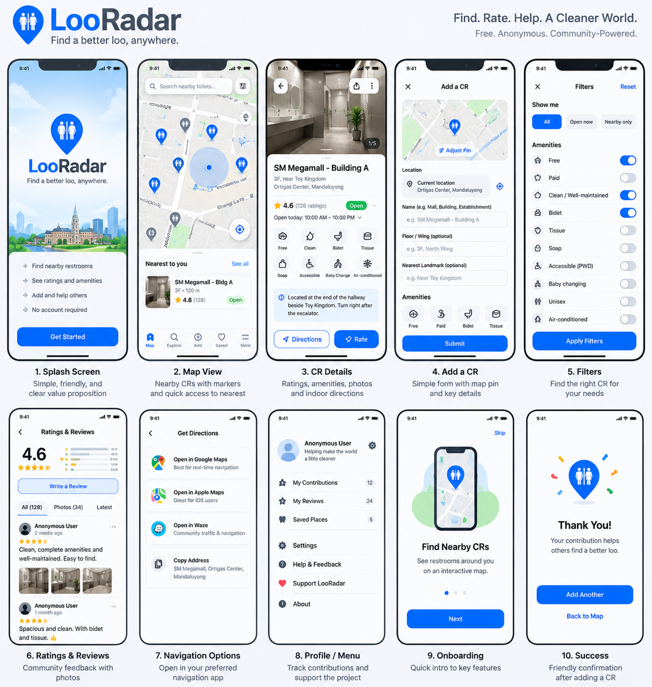

# LooRadar UI/UX Reference

## Purpose

LooRadar is a **UI/UX-first project**. The mobile experience should be designed and validated before backend convenience is allowed to shape the product.

## Canonical visual reference

The canonical build reference is:

`docs/assets/looradar-mobile-ux-reference.png`

The checked-in SVG is a secondary lightweight reference only. If the PNG and SVG differ, the PNG takes precedence.

The mockup is not a pixel-perfect final specification, but implementation should preserve its journey, hierarchy, interaction model, and overall visual direction unless an intentional UX decision is documented in the same pull request.

## Core UX principles

1. **Map first.** The primary screen is the map with nearby restroom markers.
2. **Immediate utility.** Users should be able to find nearby restrooms without creating an account.
3. **Low-friction contribution.** Adding a restroom should require only the minimum useful information.
4. **Useful quality signals.** Ratings, amenities, access type, and recent verification should help users choose quickly.
5. **Indoor context matters.** Building, floor, wing, landmark, and indoor directions are first-class fields because GPS alone is insufficient in malls, airports, stations, and large buildings.
6. **Privacy by default.** Foreground location is used only for the immediate task and is not retained as movement history.
7. **Global language.** Use restroom/toilet terminology in core UI while allowing localization later.
8. **Accessibility.** Touch targets, contrast, text scaling, labels, and screen-reader support must be considered from the first implemented screens.

## Primary screen sequence

### 1. Splash / value proposition

Communicate what LooRadar does before requesting location permission.

Include:

- LooRadar branding
- concise value proposition
- nearby restroom discovery
- ratings and amenities
- community contribution
- no-account-required message
- primary Get Started action

### 2. Map / discovery

Goal: get the user to a suitable restroom with minimal interaction.

Include:

- Google Map
- current-position indicator
- restroom pins
- map controls
- nearest-restroom card/list
- marker clustering at dense zoom levels
- quick signals such as rating, distance, and access/open status when trustworthy

The map should remain useful even when no restroom records are nearby.

### 3. Restroom details

Goal: answer: **Is this restroom suitable for me?**

Show:

- place/building name
- floor/wing/landmark
- overall rating and count
- access/open status where reliable
- amenities
- accessibility information
- indoor directions
- recent verification status
- Directions action
- Rate action
- Verify / Report actions

Photos may appear conceptually in the mockup but remain post-MVP unless scope is explicitly changed.

### 4. Add restroom

Flow:

1. start from current location or selected map point;
2. show adjustable pin;
3. enter place/building;
4. optionally enter floor/wing;
5. optionally enter landmark/indoor directions;
6. select amenities/access attributes;
7. run duplicate warning;
8. submit using anonymous Firebase identity.

Do not require personal profile information.

### 5. Filters

Keep initial filters concise and task-oriented:

- accessible
- baby changing
- free
- paid
- customer only
- male
- female
- all gender
- bidet
- tissue
- soap
- recently verified
- open now only when trustworthy opening-hours data exists

## Additional flows

The visual direction also informs:

- ratings and reviews
- external navigation choices
- settings/support
- onboarding/location-permission explanation
- successful contribution confirmation

These should be implemented only when their phase is reached.

## UI design direction

- clean, modern mobile utility
- light/default theme first
- blue primary action and map-marker language
- white/neutral surfaces
- green for positive/open/verified status
- amber for ratings/warnings where appropriate
- rounded cards and controls
- uncluttered map surfaces
- bottom sheets/cards for contextual map actions

## Design-system expectations

Before broad feature implementation, establish reusable tokens/components for:

- spacing
- typography
- corner radius
- elevation
- semantic status colors
- buttons
- chips/filter pills
- form fields
- map markers and clusters
- restroom cards
- amenity icons/rows
- loading, empty, offline, error, and permission-denied states

Do not scatter arbitrary visual constants across individual screens.

## UX validation gates

Any phase that changes a user-facing workflow should include:

1. confirmation that the canonical PNG still applies, or an updated approved visual;
2. implementation matching intended hierarchy and interaction path;
3. loading, empty, error, permission-denied, and degraded/offline states where applicable;
4. accessibility review;
5. screenshot/manual QA on representative Android and iOS device sizes.

## Source-of-truth rule

When implementation and this reference disagree:

- documented product, security, and privacy requirements take precedence;
- the canonical PNG defines the approved visual/interaction direction;
- intentional UX changes must be documented in the same PR;
- accidental drift is a defect, not a design decision.

The goal is to keep LooRadar **UI/UX first, architecture-supported**.
